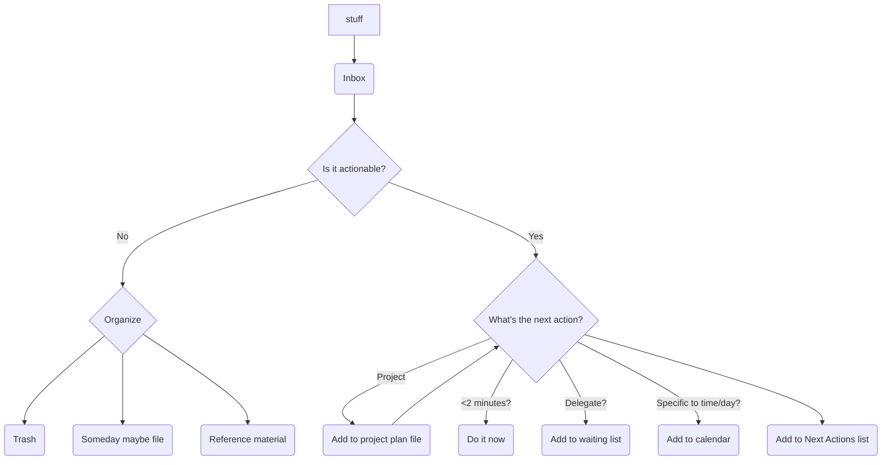

# Handy links
## [[Someday maybe file]]
## [[Projects]]
## [[Next actions]]
# Inbox list
- 

# Flow charts
![[GTD stuff flowchart.png]]

```mermaid 

flowchart TD

A["stuff"] --> B(Inbox)

B --> C{Is it actionable?}

C -->|No| D{Organize}

C -->|Yes| E{What's the next action?}

D --> F(Trash)

D --> G(Someday maybe file)

D --> H(Reference material)

E --> |Project| I(Add to project plan file)

I --> E

E --> |<2 minutes?| K(Do it now)

E --> |Delegate?| M(Add to waiting list)

E --> |Specific to time/day?| O(Add to calendar)

E --> P(Add to Next Actions list)
```